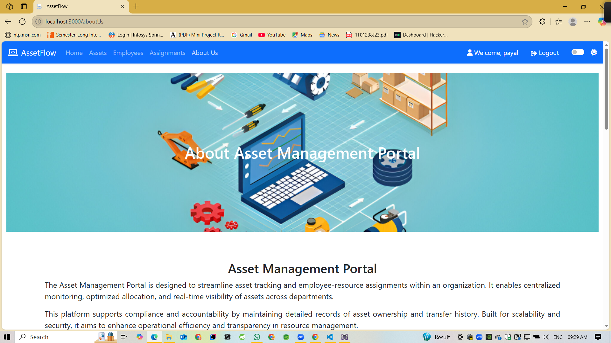
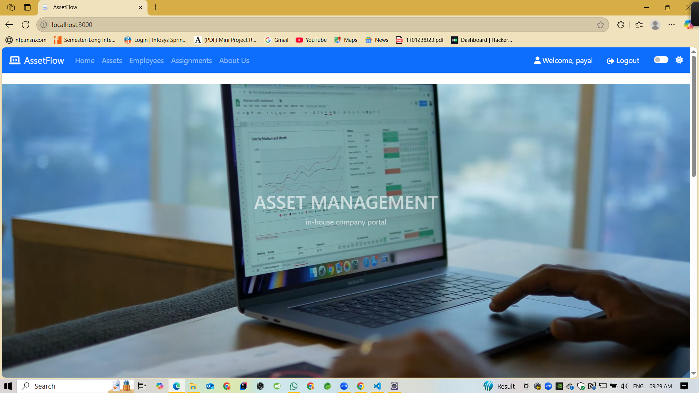
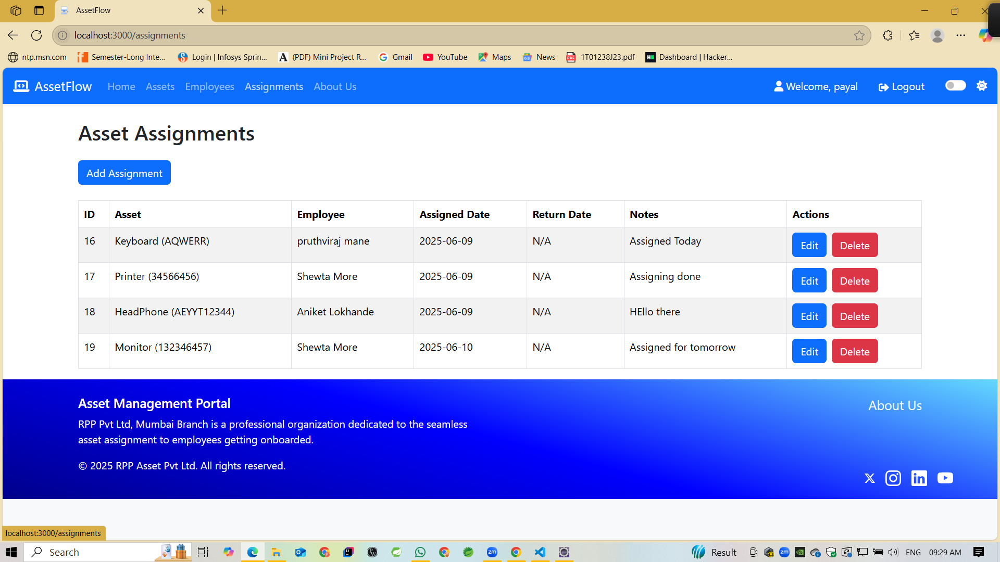
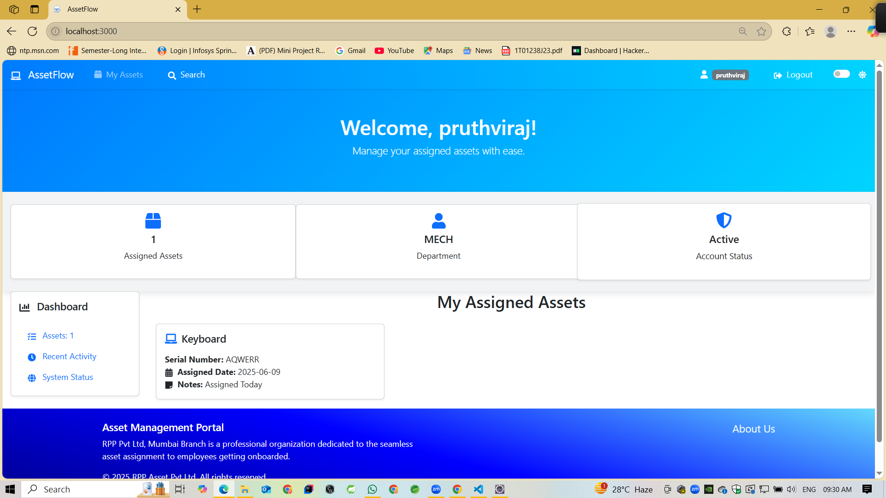

# AssetFlow - Asset Management System for Employee Onboarding

A web-based application to manage the allocation, tracking, and return of IT assets (laptops,
headsets, mice, etc.) assigned to newly onboarded employees. It ensures efficient asset
management, real-time tracking, and role-based access for Admin and Employees.

## Screenshots

### About Us



## Features

### Backend
- **User Authentication**: Secure login/registration with password hashing using `BCryptPasswordEncoder`.
- **Role-Based Access**: Admin and user roles, restricting asset management to admins.
- **Asset Management**: CRUD operations for assets (e.g., laptops, monitors).
- **Employee Management**: Register employees with roles (admin/user) and departments.
- **Assignment Tracking**: Manage asset assignments to employees.
- **RESTful APIs**: Endpoints for asset, employee, and assignment management.

### Home


### Frontend
- **Responsive UI**: Built with React and Bootstrap for a modern, mobile-friendly design.
- **Dynamic Login Page**: Features a background video (`login-background.mp4`) with an overlay.
- **Role-Based Navigation**: Admin dashboard for asset management; user dashboard for viewing assignments.
- **Form Validation**: Client-side validation for login and registration forms.


### Assignment



## Technology Stack

### Backend
- **Framework**: Spring Boot (Java 17)
- **Database**: MySQL
- **ORM**: Spring Data JPA/Hibernate
- **Security**: `BCryptPasswordEncoder` for password hashing
- **Build Tool**: Maven

### User



### Frontend
- **Framework**: React (v18)
- **Styling**: Bootstrap (v5), React-Bootstrap
- **Routing**: `react-router-dom`
- **HTTP Client**: `axios`
- **Build Tool**: Create React App (Webpack)

## Prerequisites
- Java 17
- Maven (3.x)
- Node.js (16.x or later) and npm
- MySQL (8.0 or later)

## Setup Instructions

### 1. Clone the Repository
```bash
git clone https://github.com/Pruthviraj89/assetManagement.git
cd assetmanagement
```

### 2. Backend Setup
1. Navigate to the backend folder:
   ```bash
   cd backend/assetmanagement
   ```
2. Configure MySQL in `src/main/resources/application.properties`:
   ```properties
   spring.datasource.url=jdbc:mysql://localhost:3306/assetmanagement
   spring.datasource.username=your_username
   spring.datasource.password=your_password
   spring.jpa.hibernate.ddl-auto=update
   ```
3. Install dependencies and run:
   ```bash
   mvn clean install
   mvn spring-boot:run
   ```

### 3. Frontend Setup
1. Navigate to the frontend folder:
   ```bash
   cd frontend
   ```
2. Install dependencies:
   ```bash
   npm install
   ```
4. Start the frontend:
   ```bash
   npm start
   ```

### 4. Database Setup
1. Create a MySQL database:
   ```sql
   CREATE DATABASE assetmanagement;
   ```

## API Endpoints

| Endpoint                | Method | Description                     | Access       |
|-------------------------|--------|---------------------------------|--------------|
| `/api/employees/user/login` | POST   | Authenticate user               | Public       |
| `/api/employees`        | POST   | Register employee               | Public       |
| `/api/assets`           | GET, POST | List/create assets           | Admin only   |
| `/api/assets/{id}`      | PUT, DELETE | Update/delete asset        | Admin only   |
| `/api/assignments`      | GET    | List assignments                | Admin only   |


## Frontend Routes

| Route        | Description                     | Access         |
|--------------|---------------------------------|----------------|
| `/`          | User/Admin dashboard (post-login) | Authenticated |
| `/login`     | Login page with video background | Public        |
| `/register`  | Registration page               | Public        |
| `/assets`    | Asset management (CRUD)         | Admin only    |
| `/employees` | Employee management             | Admin only    |
| `/assignments` | Asset assignment tracking     | Admin only    |

## Running the Project

1. **Backend**:
   ```bash
   cd backend/assetmanagement
   mvn spring-boot:run
   ```
   - Runs on `http://localhost:8080`.

2. **Frontend**:
   ```bash
   cd frontend
   npm start
   ```
   - Runs on `http://localhost:3000`.

3. **Access**:
   - Open `http://localhost:3000/login`.
   - Register or login with sample credentials (e.g., `admin@example.com`/`pass123`).


## Limitations

- **Video File**: `login-background.mp4` is excluded due to GitHub’s 100MB file size limit. Add it manually to `frontend/public/assets/`.
- **Sample Data**: Passwords in sample SQL are placeholders; hash them with `BCryptPasswordEncoder` before use.
